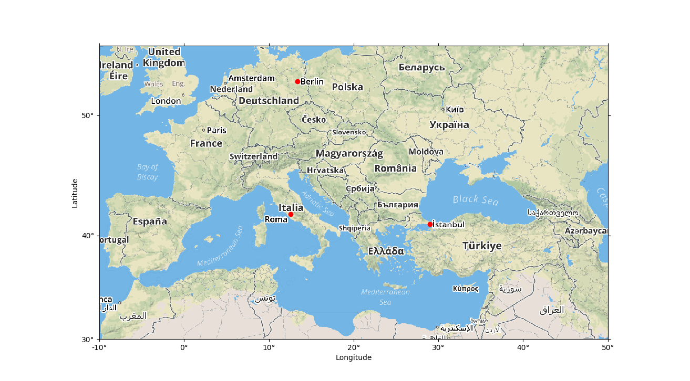

# Plot Map Tiles in Pyplot

Plot map tiles in pyplot.

I wrote this map tile plotter to create basic geo-spatial data visualizations for [powerplace.io](//powerplace.io).

## Usage

Use class `TileMap` for plotting a map. Specify a map tile provider for download of map tile images.

`MapboxMap` wraps `TileMap` for usage with [Mapbox](//www.mapbox.com) maps (see `examples.py`).

## Example

